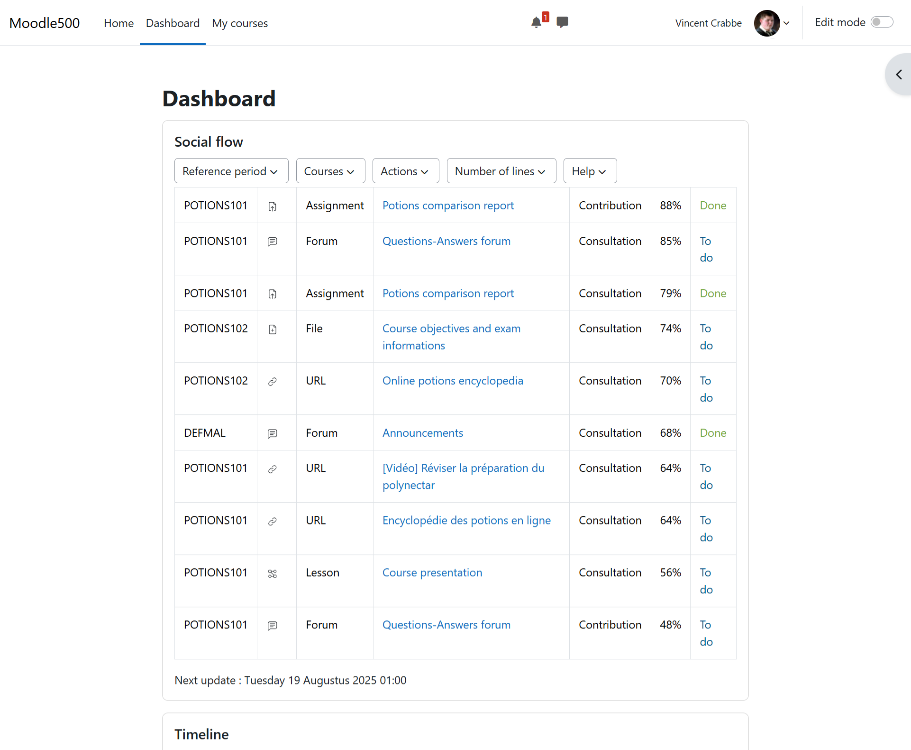
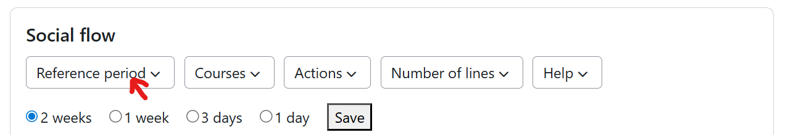
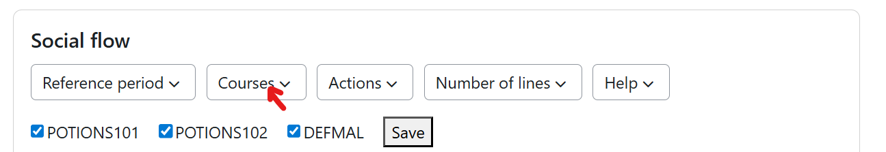
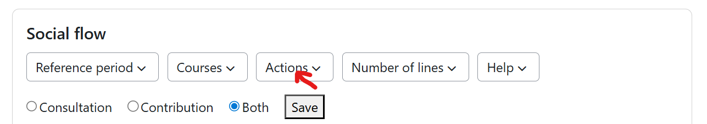
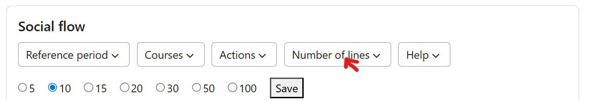
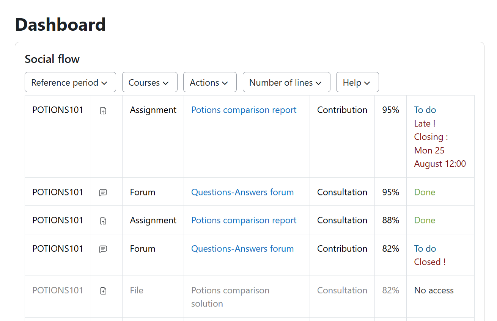
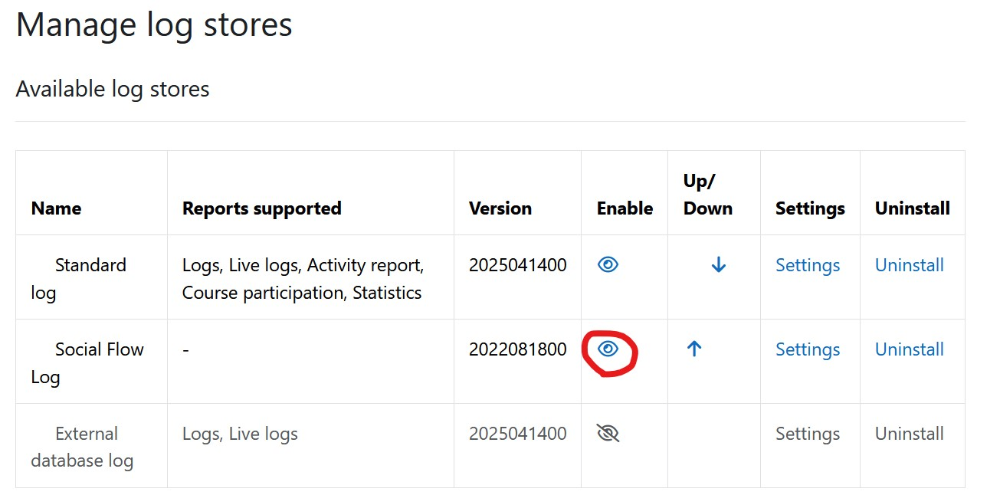
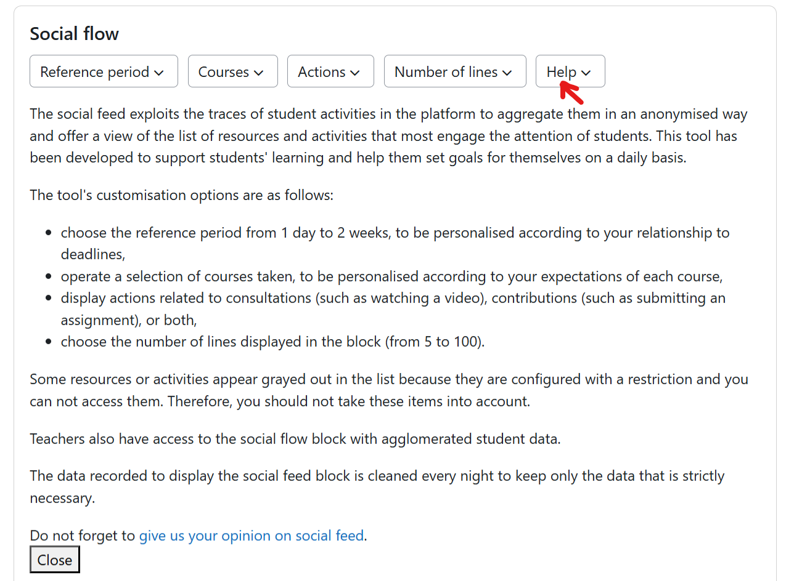

# General informations

The Social Flow proposes a view on most frequent actions in courses to student and teachers on the Moodle dashboard.


## Student preferences
The Social Flow view may be customized by each student with several preferences:
- reference period : depending on its relationship to deadlines, student may configure reference period to 1 day to 2 weeks;


- courses selection : student may decide the Social Flow to present actions occuring in a selection of its courses depenting on its expectations for each course;

  
- action type : enable the student to display 'consultation' actions (like playing a video), 'contribution' actions (like submitting a quiz attempt) or both;

  
- number of lines : defines the number of lines to display in the social flow view.


## Informations about closing dates 
Activities with closing date are associated to contextual informations about the closing date.

It has not been possible to exclude modules with access restrictions from social flow, but they are presented as inactive in the social flow table. 

# One view based on two plugins
The Social Flow view is based on two plugins:
- `logstore_socialflow`: Logs the events to the database and makes all data treatements with a performant approach; you need to install this dependency first
- `block_socialflow`:  Block to display the Social Flow data on the dashboard.

# Installation

## Requirements
- Moodle: Version 4.4 or higher (currently testing with 4.4, 4.5, 5.0 and 5.1)
- Database: MySQL/MariaDB or Postgres (other database types are implemented but have not been tested)

## Download
First, download and install the [last official version of plugin logstore_socialflow](https://moodle.org/plugins/logstore_socialflow). 

Afterwards, install the [last official version of plugin block_socialflow](https://moodle.org/plugins/block_socialflow).

## Cutomize the logged events
The social flow stores only a selection of events linked to student actions performed in the courses.
Detailed informations about Moodle event API may be found in [Moodle Event API documentation page](https://docs.moodle.org/dev/Events_API). 
The logged actions are stored in the `logstore_socialflow_evts` table, that you may augment with your additionnal plugins events.
Note that each plugin defines its associated events in `classes/event` folder.
Events in `logstore_socialflow_evts` table may have 2 types : 
- `consult` (like `\mod_assign\event\course_module_viewed`) for actions associates to a student resource or activity consultation,
- `contrib` (like `\mod_assign\event\assessable_submitted`) for actions associated to a student activity contribution.
  
The social flow takes into account the activities closing date and late date and information.  Closing date and late date fields names are therefore necessary to define a new event in `logstore_socialflow_evts` table:
- `moduletable`: stores the name of the table where the closing or late date field are stored (often the plugin name but not always)
- `hasclosingdate` : takes value '0' if no closing date may be associated to this module and takes value '1' if the module supports closing date
- `closingdatefield` : label of the table field storing the closing date (action may no more be proceeded after this date)
- `haslatedate` : takes value '0' if no late date may be associated to this module and takes value '1' if the module supports late date
- `closingdatefield` : label of the table field storing the late date (action may still be proceeded after this date, but are noted as late)

## Activate the logstore
After installation you need to enable the logstore plugin via this menu :
> Administration > Site administration > Plugins > Manage log stores

There should be a row for the installed logstore plugin with the name Socialflow Log and you have to click lick on the eye icon (👁) to enable the log store.


## Run scheduled tasks
The plugin is configure to run 3 cron tasks during the night to refresh the social flow block informations. These tasks are configured to be runned during the night and no data are presented in the social flow block as far has these tasks have not been triggered.

On a test platform, you have to make some actions in courses as a student and then run the 2 cron task associated to social flow so that social flow tables are filled: 
- first run `\logstore_socialflow\task\nbpa_task` task (computes the number of students in each `logstore_socialflow_log` table logged course and stores this informations in the `logstore_socialflow_nbpa` table )
- then run the `\logstore_socialflow\task\hits_task` task (computes the number of hits for each action in the `logstore_socialflow_log` table and stores this in the `logstore_socialflow_hits` table; then get informations about the closing dates of logged activities and stores it in the `logstore_socialflow_closing` table)

Note that `\logstore_socialflow\task\cleanup_task` performs data cleanup in the log table.

If needed, the scheduled tasks may be runned manually while following the [Official documentation on scheduled tasks](https://docs.moodle.org/500/en/Scheduled_tasks).

## Import data from logstore_standard

After installation, all data are empty as no data has been logged so far. But your Moodle site might log data through Moodle's own logging system, the `logstore_standard_log`. The logstore plugin offers a simple way to import that data by using the import.php script. It can be called from the shell like this:

```$ cd MOODLE_PATH/admin/tool/log/store/socialflow```

```$ php cli/import.php```

This will immediately start the import process. 

# Configuration

You only have to configure the log plugin. The logstore plugin has options related to logging data and writing data to the database. The block plugin has no option but need to be added on the Default Dashboard via menu
> Administration > Site administration > Appearance > Default Dashboard page

The log plugin settings page can be found in:
> Administration > Site Administration > Plugins > Log plugins > Socialflow

The logstore has the following options:
- `log_scope`: One of all, include, exclude. Defines the scope of the logging process. By default, everything is logged.
       * Option all: Logs all events
       * Option include: Log events only in courses specified via course_ids
       * Option exclude: Log events excluding the courses specified via course_ids
- `course_ids`: To be used with the log_scope option include or exclude to only track specific courses. Example: 10,153,102.
- `tracking_roles`: Define which roles should be tracked (whitelist) unless specified via nontracking_roles. This is useful if you only want to track specific roles (like students or guests). By default, all roles are tracked. Example: student,guest. See Role Tracking for more information.
- `nontracking_roles`: Define which roles should not be tracked. This is useful if you don't want to track specific roles (like managers or teachers). By default, no roles are ignored. Example: teacher,editingteacher,manager. See Role Tracking for more information.
- `buffersize`: Same as buffersize of other loggers. In case a single page fires more than one event, this is the number of events that will be buffered before writing them to database. Defaults to 50.

# Feedback form integration
The block plugin make it possible to integrate a link toward a feedback form to collect students appreciation about social flow.
As you may want to decline the survey in several languages, the sentence to invite students to answer the feedback form has been composed based on the below langage strings :

```$string['surveylink'] = "";```

```$string['surveytextintro'] = "<div>Do not forget to  ";```

```$string['surveytextlink'] = "give us your opinion on social flow";```

```$string['surveytextend'] = ".</div>";```

If the `surveylink` string is non empty, the sentence to invite students to answer the feedback form will be added at the end of the help tab as shown bellow :


# Data privacy

Social Flow plugins log some personal data like any log plugin. 

When an event is triggered inside of Moodle, the following data is logged by the logstore plugin:

Table: `logstore_socialflow_log`
- `id` : BIGINT 	 
- `eventid` : INT (Type of action, e.g. "Resource viewed")
- `courseid` :	BIGINT (Corresponding course)
- `contextid` : BIGINT (Corresponding context, e.g. ID of the resource that was viewed)
- `timecreated` : BIGINT (Date and time, exact to the second)

In addition, there are helper tables, that do not store data-privacy related data and only exist to speed up queries or to minimize storage requirements.

This plugin was developed with data privacy in mind.
It proceeds a new data treatement that is clearly described in the help tab of the block plugin to ensure efficient user information (see illustration above).
This new treatement should be described in the data privacy statement.

# Reference

The Social Flow plugins were developed by [Isabelle Motte](https://www.uclouvain.be/fr/people/isabelle.motte) from [Université catholique de Louvain](https://www.uclouvain.be) in the context of a technical development for a career evolution. This development is presented in detail in the associated report :

[Moodle Learning Analytics: how to extract log data efficiently ? Feedback on the development of social flow plugins](https://dial.uclouvain.be/pr/boreal/object/boreal:308602)

This work is based on the [Learning Analytics Plugins](https://moodle.org/plugins/local_learning_analytics) developed by Thomas Dondorf at RWTH Aachen University in the context of his PhD dissertation:
>Dondorf, T. (2022). Learning Analytics for Moodle: Facilitating the Adoption of Data Privacy Friendly Learning Analytics in Higher Education (Dissertation). Rheinisch-Westfälische Technische Hochschule Aachen, Aachen. https://doi.org/10.18154/RWTH-2022-04002
